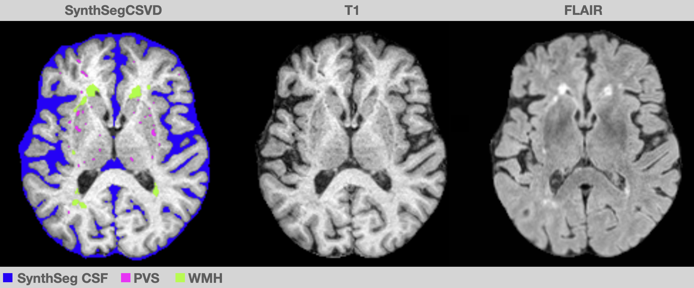

# **SynthSegCSVD**


* SynthSegCSVD is a CNN-based segmentation tool for segmenting white matter hyperintensities (WMH) on FLAIR MRI and perivascular spaces (PVS) on T1 MRI
* SynthSegCSVD was developed using patient MRI with varying degrees of cerebral small vessel disease (CSVD) burden, in combination with FreeSurfer's SynthSeg tool (https://surfer.nmr.mgh.harvard.edu/fswiki/SynthSeg), which was developed using synthetic data derived from a generative model conditioned on label maps from full-brain segmentations without PVS labels
* SynthSegCSVD is distributed as a docker/singularity image
* If you use SynthSegCSVD in your work please cite:

    * SynthSeg: Segmentation of brain MRI scans of any contrast and resolution without retraining. B Billot, DN Greve, O Puonti, A Thielscher, K Van Leemput, B Fischl, AV Dalca, JE Iglesias. Medical Image Analysis, 83, 102789 (2023). 
    * RORPO (SynthSegCSVD PVS): Odyssée Merveille, Hugues Talbot, Laurent Najman, Nicolas Passat. Ranking orientation responses of path operators: Motivations, choices and algorithmics. International Symposium on Mathematical Morphology (ISMM), 2015, Reykjavik, Iceland. pp.633-644, 10.1007/978-3-319-18720-4_53 . hal- 01168732
    * SynthSegCSVD PVS: [TODO] Coming soon
    * SynthSegCSVD WMH: [TODO] Coming soon





### **Input Images**
* WMH Segmentation
    * FLAIR image 
    * SynthSeg output (version 2.0 with CSF)
* PVS Segmentation 
   * T1 image
   * SynthSeg output (version 2.0) with CSF
   * WMH segmentation (can be an empty image for populations without WMHs)
   * Optional: T1 + T1xFLAIR RORPO (see section 4 for details)


### **Installation and General Instructions**

* download SynthSegCSVD.sif from: [TODO] Coming soon
* define variables (described in the variable setup sections)
* execute run command (can be copy/pasted without modification once variables are defined)
* for PVS segmentation, three run commands are provided to generate the optional RORPO input, varying in how WMHs are handled (see section 4 for details)


<br>

# **2. WMH segmentation**
> ## **2.1 Variable Setup**
```bash
in_dir=$(pwd)
out_dir=${in_dir}
flair_fn=FLAIR.nii.gz
synth_fn=synthseg.nii.gz
sif=[TODO]... coming soon
out_fn=seg_wmh.nii.gz
seg_wmh_thr=0.3
skip_mask_and_bias=false
cleanup=true

```

where:

> **in_dir** : full path to input data, or $(pwd) for current directory
>
> **out_dir** : full path to the output data
>
> **flair_fn** : FLAIR input filename 
>
> **synth_fn** : FreeSurfer synthseg input filename (output from "mri_synthseg")
>
> **sif** : path to singulairty file downloaded above
>
> **out_fn** : wmh segmentation output filename (with file extension)
> 
> **seg_wmh_thr** : threshold for binarizing WMH segmentation output 
>
> **skip_mask_and_bias** : true | false (true if FLAIR has been masked and bias corrected, otherwise false)
>
> **cleanup** : true | false (true to remove temporary files, otherwise false)

<br>

## **2.2. Run Command**

```bash
singularity run \
  --bind ${in_dir}:/indir,${out_dir}:/outdir  --pwd /  ${sif}  segment_wmh  \
  /indir/${flair_fn} \
  /indir/${synth_fn}  \
  /outdir/${out_fn}  \
  1  \
  96  \
  ${seg_wmh_thr} \
  ${skip_mask_and_bias} \
  ${cleanup} 
```
<br>


# **3. Generate RORPO Image**
* The RORPO filter (https://github.com/path-openings/RORPO) can be used to extract small tubular structures from MR images and improves the PVS segmentation result in the following section, but requires some user-based choices for the parameters that control filter performance and how/if WMHs are handled (recommendations below)
* the input T1 image should be masked and bias corrected


> ## **3.1. Variable Setup**
```bash
in_dir=$(pwd)
out_dir=${in_dir}
in_fn=T1.nii.gz
out_fn=T1_rorpo.nii.gz
sif=[TODO]... coming soon
in_adf="0.025 1 25"
invert_contrast=1
rorpo_params="--scaleMin=1 --factor=2 --nbScales=4 --dilationSize=0 --verbose --uint8 --nbCores 8" 
in_rorpo_thresh=18
cleanup=true
seg_wmh_fn=thr_seg_wmh.nii.gz
flair_fn=FLAIR.nii.gz
in_flair_adf="0.03 2 25"
in_flair_rorpo_thresh=22
```

**WHERE:**

> **in_dir** : full path to input data, or $(pwd) to use current directory
>
> **out_dir** : full path to output data
>
> **in_fn** : input image filename (T1 or potentially T2, masked and bias corrected)
>
> **out_fn** : output image filname
>
> **sif** : path to singularity file downloaded above
>
> **in_adf** : anisotropic diffusion filter settings for input image
>
> **invert_contrast** : (for T1) invert_contrast=1 (or) invert_contrast=0 (for T2)
>
> **rorpo_params** : RORPO filter settings
>
> **in_rorpo_thresh** : input RORPO threshold
>
> **cleanup** : (remove) cleanup=true or (keep) cleanup=false (temporary files)
>
> **seg_wmh_fn** : segmenation image filename with 1s for WMHs and 0s for non-WMHs
>
> **flair_fn** : FLAIR filename
>
> **in_flair_adf** : anisotropic diffusion filter settings for input-FLAIR image
>
> **in_flair_rorpo_thresh** : input-FLAIR rorpo thresh

**NOTES**:

"rorpo_params" controls rorpo filter (for details, see online documentation: https://github.com/path-openings/RORPO)
*  the "--core" option controls multicore performace
*  setting "--factor" between 1.8 and 2 and "--nbScales" between 4-5 should be appropriate for PVS detection

"in_adf" controls image smoothing
*  the first value controls the time step and should not need to be varied
*  the second value controls the conductance parameter and should be set approximately equal to the voxel size
*  the third value controls the number of iterations is dependent upon image SNR (we use ~20-25 for T1 images)

"cleanup"
* can be set to false to troubleshoot or refine any of the settings


<br>

> ## **3.2. Run Commands**
> ### **1. RORPO + WMH exclusion and WMH recovery (recommended approach)**
```bash
singularity run  --bind ${in_dir}:/indir,${out_dir}:/outdir \
  --pwd / \
  ${sif} \
  get_rorpo \
  /indir/${out_fn} \
  /indir/${in_fn} \
  "${in_adf}" \
  ${invert_contrast} \
  "${rorpo_params}" \
  ${in_rorpo_thresh} \
  ${cleanup} \
  /indir/${seg_wmh_fn} \
  /indir/${flair_fn} \
  "${in_flair_adf}" \
  ${in_flair_rorpo_thresh}
``` 

> ### **2. RORPO + WMH exclusion**
```bash
singularity run --bind ${in_dir}:/indir,${out_dir}:/outdir \
  --pwd / \
  ${sif} \
  get_rorpo \
  /indir/${out_fn} \
  /indir/${in_fn} \
  "${in_adf}" \
  ${invert_contrast} \
  "${rorpo_params}" \
  ${in_rorpo_thresh} \
  ${cleanup} \
  /indir/${wmh_seg}
``` 

> ### **3. RORPO only**
```bash
singularity run --bind ${in_dir}:/indir,${out_dir}:/outdir \
  --pwd / \
  ${sif} \
  get_rorpo \
  /indir/${out_fn} \
  /indir/${in_fn} \
  "${in_adf}" \
  ${invert_contrast} \
  "${rorpo_params}" \
  ${in_rorpo_thresh} \
  ${cleanup} 
``` 
<br>


# **4. Generate PVS Segmentation**
> ## **4.1. Variable Setup**
```bash
in_dir=$(pwd)
out_dir=${in_dir}
t1_fn=T1.nii.gz
rorpo_fn=T1_rorpo.nii.gz
seg_wmh_fn=thr_seg_wmh.nii.gz
synth_fn=synthseg.nii.gz
out_pfx=seg
sif=[TODO]... coming soon
cleanup=true
skip_mask_and_bias=true
```

**WHERE:**

> **in_dir** : full path to input data, or $(pwd) to use current directory
>
> **out_dir** : full path to output data
>
> **t1_fn** : T1 filename 
>
> **rorpo_fn** : RORPO filename (or "" to omit with a reduction PVS segmentation accuracy)
> 
> **sif** : path to singularity file downloaded above
>
> **seg_wmh_fn** : WMH segmentation filename (or empty image to skip)
> 
> **out_pfx** : output prefix (no extension, will append _pvs.nii.gz / _pvs_no_rorpo.nii.gz | _pvs_with_rorpo.nii.gz)
> 
> **skip_mask_and_bias** : true | false (true if FLAIR has been masked and bias corrected, otherwise false)
>
> **cleanup** : true | false (true to remove temporary files, otherwise false)

> ## **4.2. Run Command**
```bash
singularity run --bind ${in_dir}:/indir,${out_dir}:/outdir \
  --pwd / \
  ${sif} \
  segment_pvs \
  /indir/${t1_fn} \
  /indir/${synth_fn} \
  /indir/${rorpo_fn} \
  /indir/${seg_wmh_fn} \
  /outdir/${out_pfx} \
  1 0 \
  ${skip_mask_and_bias} \
  ${cleanup}
```
